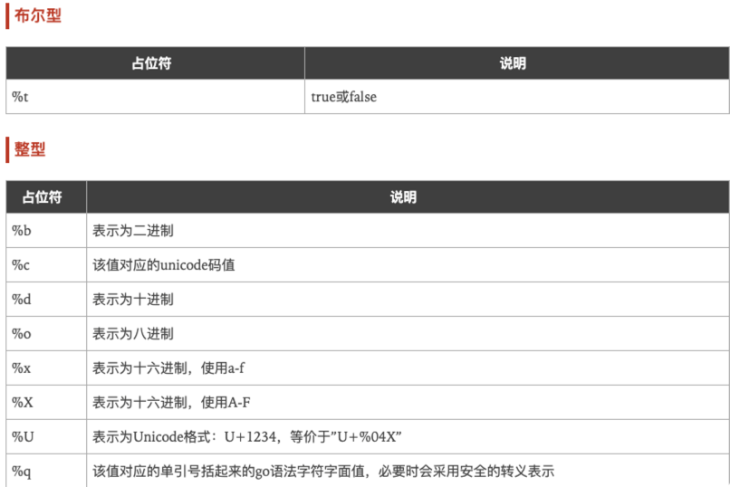

# learn-golang

# Golang

### 导入包的找寻顺序

编译器会首先查找 Go 的安装目录，然后才会按顺序查找 GOPATH 变量里列出的目录

```markdown
1. $GOROOT/src
2. $GOPATH/src
```

---

### 切片

`s1 := s2[起始索引 : 结束索引（不包含） : 容量截止索引​]`

切片之间共享底层数组，修改数据会同时影响所有的切片

```go

s7 := []int{1, 2, 4, 5, 7, 9}
s8 := s7[1:3]
fmt.Println(s8, len(s8), cap(s8)) 	// [2 4] 2 5
s8[1] = 88
fmt.Println(s8)	// [2 88]
fmt.Println(s7)	// [1 2 88 5 7 9]

```

切片使用append时，若底层数组有足够的容量，则切片追加使底层数组的追加索引位置的数据被覆盖；若底层数组容量不足，切片追加将创建一个新的底层数组，容量为切片容量的两倍，且不影响原底层数组数据。

> 函数 append 会智能地处理底层数组的容量增长。在切片的容量小于 1000 个元素时，总是 会成倍地增加容量。一旦元素个数超过 1000，容量的增长因子会设为 1.25，也就是会每次增加 25% 的容量。随着语言的演化，这种增长算法可能会有所改变。

```go
s8 = append(s8, 99)
fmt.Println(s8, len(s8), cap(s8)) // [2 88 99] 3 5
fmt.Println(s7) // [1 2 88 99 7 9]

s8 = append(s8, 100, 100)
fmt.Println(s8, len(s8), cap(s8)) // [2 88 99 100 100] 5 5
fmt.Println(s7) // [1 2 88 99 100 100]

s8 = append(s8, 101)
fmt.Println(s8, len(s8), cap(s8)) // [2 88 99 100 100 100] 6 10
```

在创建切片时设置切片的容量和长度一样，就可以强制让新切片的第一个 append 操作 创建新的底层数组，与原有的底层数组分离。新切片与原有的底层数组分离后，可以安全地进行 后续修改

```go
s9 := []int{1, 2, 3, 4}
s10 := s9[1:3:3]
fmt.Println(s10, len(s10), cap(s10)) // [2 3] 2 2
s10 = append(s10, 5)
fmt.Println(s10, len(s10), cap(s10)) // [2 3 5] 3 4
fmt.Println(s9, len(s9), cap(s9))    // [1, 2, 3, 4] 4 4
```

---

### new 和 make 的区别

* make 只能用来分配及初始化类型为 slice、map、chan 的数据。new 可以分配任意类型的数据；
* new 分配返回的是指针，即类型 *Type。make 返回引用，即 Type；
* new 分配的空间被清零。make 分配空间后，会进行初始化；


---

### map映射


---

### openfile常见模式和权限

```go
file, err := os.OpenFile("log.log", os.O_CREATE|os.O_WRONLY|os.O_APPEND, os.ModePerm)
```

```go
const (
    // Exactly one of O_RDONLY, O_WRONLY, or O_RDWR must be specified.
    // 只读模式
    O_RDONLY int = syscall.O_RDONLY // open the file read-only.
    // 只写模式
    O_WRONLY int = syscall.O_WRONLY // open the file write-only.
    // 可读可写
    O_RDWR   int = syscall.O_RDWR   // open the file read-write.
    // The remaining values may be or'ed in to control behavior.
    // 追加内容
    O_APPEND int = syscall.O_APPEND // append data to the file when writing.
    // 创建文件，如果文件不存在
    O_CREATE int = syscall.O_CREAT  // create a new file if none exists.
    // 与创建文件一同使用，文件必须存在
    O_EXCL   int = syscall.O_EXCL   // used with O_CREATE, file must not exist.
    // 打开一个同步的文件流
    O_SYNC   int = syscall.O_SYNC   // open for synchronous I/O.
    // 如果可能，打开时缩短文件
    O_TRUNC  int = syscall.O_TRUNC  // truncate regular writable file when opened.
)
```

```go
const (
    // The single letters are the abbreviations
    // used by the String method's formatting.
    // 文件夹模式
    ModeDir        FileMode = 1 << (32 - 1 - iota) // d: is a directory
    // 追加模式
    ModeAppend                                     // a: append-only
    // 单独使用
    ModeExclusive                                  // l: exclusive use
    // 临时文件
    ModeTemporary                                  // T: temporary file; Plan 9 only
    // 象征性的关联
    ModeSymlink                                    // L: symbolic link
    // 设备文件
    ModeDevice                                     // D: device file
    // 命名管道
    ModeNamedPipe                                  // p: named pipe (FIFO)
    // Unix 主机 socket
    ModeSocket                                     // S: Unix domain socket
    // 设置uid
    ModeSetuid                                     // u: setuid
    // 设置gid
    ModeSetgid                                     // g: setgid
    // UNIX 字符串设备，当设备模式是设置unix
    ModeCharDevice                                 // c: Unix character device, when ModeDevice is set
    // 粘性的
    ModeSticky                                     // t: sticky
    // 非常规文件；对该文件一无所知
    ModeIrregular                                  // ?: non-regular file; nothing else is known about this file

    // bit位遮盖，不变的文件设置为none
    // Mask for the type bits. For regular files, none will be set.
    ModeType = ModeDir | ModeSymlink | ModeNamedPipe | ModeSocket | ModeDevice | ModeCharDevice | ModeIrregular
    // 权限位
    ModePerm FileMode = 0777 // Unix permission bits
)
```


---

### Golang异常

`panic` 主动抛出异常，和`raise`效果相同

`recover()` 捕获异常，使程序发生panic时不报错

```go
var (
	ErrorOne = errors.New("error one test")
	ErrorTwo = errors.New("error two test")
	ErrorFmt = fmt.Errorf("fmt error format %%")
)

// panicTest
func panicTest() {
	defer func() {
		fmt.Println("defer after panic")
		fmt.Println(recover()) // recover() 捕获异常
	}()

	if ErrorOne != nil {
		fmt.Printf("error: %v\n", ErrorOne)
		panic(ErrorOne) // raise `ErrorOne` exception
	}
}

// recoverTest
func recoverTest() {
	defer func() {
    // recover()
		fmt.Println(recover()) // recover() 捕获异常
	}()

	if ErrorTwo != nil {
		panic(ErrorTwo) // raise `ErrorOne` exception
	}
}
```


---

### fmt

* `print`：打印后不换行
* `println`：打印后换行
* `printf`： 格式化打印，不换行
* `Errorf`: 格式化字符串，返回error对象
* `Sprint`：拼接（字符串）后， 返回新字符串
* `Sprintln`：拼接（字符串）后，末尾带换行，返回新字符串
* `Sprintf`：格式化后拼接，返回新字符串
* `Fprint`：写入文件，不带换行
* `Fprintln`：写入文件，带换行
* `Fprintf`：格式化后，写入文件，不带换行

```go
func main() {
	// func Print(a ...interface{}) (n int, err error) {}
	// n = len(a)
	fmt.Print("fmt.Print(): not format, no line break")

	// func Println(a ...interface{}) (n int, err error) {}
	// n = len(a + '\n')
	fmt.Println("fmt.Println(): line break")

	// func Printf(format string, a ...interface{}) (n int, err error) {}
	fmt.Printf("%s: format string, no line break \n", "fmt.Printf()")

	// func Errorf(format string, a ...interface{}) error {}
	err := fmt.Errorf("%s: format, return error", "fmt.Errorf") // return errors.New(s string)
	fmt.Printf("err: %v\n", err)

	file, _ := os.OpenFile("log.log", os.O_WRONLY|os.O_APPEND|os.O_CREATE, os.ModePerm)

	// func Fprint(w io.Writer, a ...interface{}) (n int, err error) {}
	_, _ = fmt.Fprint(file, "fmt.Fprint(): write to file, no line break\n")

	// func Fprintln(w io.Writer, a ...interface{}) (n int, err error) {}
	_, _ = fmt.Fprintln(file, "fmt.Fprintln(): write to file, line break")

	// func Fprintf(w io.Writer, format string, a ...interface{}) (n int, err error) {}
	_, _ = fmt.Fprintf(file, "%s: write to file, format, no line break\n", "fmt.Fprintf()")

	// func Sprint(a ...interface{}) string {}
	s := fmt.Sprint("fmt.Sprint(): ", "connet string, ", "no line break, ", "return new string")
	fmt.Println(s)

	// func Sprintln(a ...interface{}) string {}
	s = fmt.Sprintln("fmt.Sprintln(): ", "connet string, ", "line break, ", "return new string")
	fmt.Println(s)
	
	// func Sprintf(format string, a ...interface{}) string {}
	s = fmt.Sprintf("%s: %s, %s, %s, %s\n", "fmt.Sprintf()", "connet string", "format", "no line break", "return new string")
	fmt.Println(s)
}
```
**占位符**




---

### sync.Pool

我们通常用golang来构建高并发场景下的应用，但是由于golang内建的GC机制会影响应用的性能，为了减少GC，golang提供了对象重用的机制，也就是sync.Pool对象池。 sync.Pool是可伸缩的，并发安全的。其大小仅受限于内存的大小，可以被看作是一个存放可重用对象的值的容器。 设计的目的是存放已经分配的但是暂时不用的对象，在需要用到的时候直接从pool中取。

任何存放区其中的值可以在任何时候被删除而不通知，在高负载下可以动态的扩容，在不活跃时对象池会收缩。

```go
package main

import (
	"fmt"
	"sync"
)

type Person struct {
	Name string
}

var pool *sync.Pool

func init() {
	pool = &sync.Pool{
		New: func() interface{} {
			fmt.Println("create new Person")
			return new(Person)
		},
	}
}

func main() {
	p1 := pool.Get().(*Person)
	fmt.Printf("p type: %#v\n", p1)

	var (
		p2 = &Person{Name: "p2"}
		p3 = &Person{Name: "p3"}
	)

	pool.Put(p2)
	pool.Put(p3)
	fmt.Printf("p name: %v\n", p2.Name)
	fmt.Printf("p name: %v\n", pool.Get().(*Person).Name)
	fmt.Printf("p name: %v\n", pool.Get().(*Person).Name)
}

// create new Person
// p type: &main.Person{Name:""}
// p name: p2
// p name: p2
// p name: p3
```


---

### time

```go
package main

import (
	"fmt"
	"time"
)

func timeTimerTicker() {
	timer := time.NewTimer(5 * time.Second)   // 指定时间执行一次
	ticker := time.NewTicker(1 * time.Second) // 指定时间段循环执行

	fmt.Println("now: ", time.Now())
	defer ticker.Stop()

	for {
		select {
		case <-timer.C:
			fmt.Println("timer Done at: ", time.Now())
			return
		case t := <-ticker.C:
			fmt.Println("ticker at: ", t)
		}
	}
}

func timeDemo() {
	// 当前时间
	now := time.Now()
  fmt.Println(now.Weekday().String()) // 星期几 Tuesday

	// 当前时间的UTC格式
	fmt.Println(now.UTC())

	// Time转时间戳
	fmt.Println(now.Unix())     // 以秒为单位
	fmt.Println(now.UnixNano()) // 以纳秒为单位

	// 时间戳转Time
	fmt.Println(time.Unix(now.Unix(), 0))

	// Time格式化 格式化的模板为Go的诞生时间2006年1月2号15点04分 Mon Jan
	fmt.Printf(
		"%d-%02d-%02d %02d:%02d:%02d\n",
		now.Year(), now.Month(), now.Day(),
		now.Hour(), now.Minute(), now.Second(),
	)
	fmt.Println(now.Format("2006-01-02 15:04:05"))
	fmt.Println(now.Format("2006-01-02 15:04:05.000"))
	fmt.Println(now.Format("2006-01-02 15:04:05.000 Mon Jan"))    // 24小时制
	fmt.Println(now.Format("2006-01-02 03:04:05.000 PM Mon Jan")) // 12小时制
	fmt.Println(now.Format("2006/01/02 15:04"))
	fmt.Println(now.Format("15:04 2006/01/02"))
	fmt.Println(now.Format("2006/01/02"))

	// Time字符串解析	（默认待解析的字符串为UTC时间）
	timeString := "2021-07-27 15:11:44.006829"
	t, _ := time.Parse("2006-01-02 15:04:05.000000", timeString)
	fmt.Println(t, t.UTC())

	// 加载时区
	loc, _ := time.LoadLocation("Asia/Shanghai")
	t, _ = time.ParseInLocation("2006-01-02 15:04:05.000000", timeString, loc)
	fmt.Println(t, t.UTC())
	fmt.Println("now in Asia/Shanghai:", now.In(loc)) // 转换时区

	// UTC时区
	loc, _ = time.LoadLocation("UTC")
	t, _ = time.ParseInLocation("2006-01-02 15:04:05.000000", timeString, loc)
	fmt.Println(t, t.UTC())
	fmt.Println("now in UTC:", now.In(loc)) // 转换时区

	// 转换时区

	// Time操作 Add Sub Equal Before After
	fmt.Println(now, now.Add(time.Hour))
	fmt.Println(now.Add(-time.Hour))            // 加减时间
	fmt.Println(now.Add(time.Hour).Sub(now))    // 1h0m0s 时间差
	fmt.Println(now.Equal(now.Add(time.Hour)))  // 判断两个时间是否相同，会考虑时区的影响，因此不同时区标准的时间也可以正确比较
	fmt.Println(now.After(now.Add(time.Hour)))  // false
	fmt.Println(now.Before(now.Add(time.Hour))) // true

}

func main() {
	timeTimerTicker()
	//timeDemo()
}

```


---

### 随机数rand

```go
rand.Intn(n int) return int
```


---

### testing

* **基础单元测试** `go test -v`

```go
package main

import (
	"fmt"
	"testing"
)

func IntMin(a, b int) int {
	if a < b {
		return a
	} else {
		return b
	}
}

// 通常编写一个名称以 `Test` 开头的函数来创建测试。
func TestIntMinBasic(t *testing.T) {
	ans := IntMin(2, -2)
	if ans != -2 {
		// `t.Error*` 会报告测试失败的信息，然后继续运行测试。
		// `t.Fail*` 会报告测试失败的信息，然后立即终止测试。
		t.Errorf("IntMin(2, -2) = %d; want -2", ans)
	}
}
```

* **表组测试** `go test -v`

```go
// 单元测试可以重复，所以会经常使用 *表驱动* 风格编写单元测试，
// 表中列出了输入数据，预期输出，使用循环，遍历并执行测试逻辑。
func TestIntMinTableDriven(t *testing.T) {
	var tests = []struct {
		a, b int
		want int
	}{
		{0, 1, 0},
		{1, 0, 0},
		{2, -2, -2},
		{0, -1, -1},
		{-1, 0, -1},
	}

	for _, tt := range tests {
		// t.Run 可以运行一个 "subtests" 子测试，一个子测试对应表中一行数据。
		// 运行 `go test -v` 时，他们会分开显示。
		testname := fmt.Sprintf("[a:%d,b:%d]", tt.a, tt.b)
		t.Run(testname, func(t *testing.T) {
			ans := IntMin(tt.a, tt.b)
			if ans != tt.want {
				t.Errorf("got %d, want %d", ans, tt.want)
			}
		})
	}
}
```

* **基准测试** `go test -v -run="none" -bench=. [-benchtime="3s"] [-benchmem]`

我们给-run 选项传递了字符串"none"，来保证在运行指定的基准测试函数之前没有单元测试会被运行

```go
// 基准测试 测试代码性能 必须以Benchmark开头
func BenchmarkIntMin(b *testing.B) {
	b.ResetTimer() // 重置计时器

	for i := 0; i < b.N; i++ {
		//IntMin(1, 2)
		for i, rst := 1, 0; i < 101; i++ {
			rst += i
		}
	}
}
```


---

### pg

```go
package main

import (
	"database/sql"
	"fmt"
	_ "github.com/lib/pq"
)

func CheckErr(err error) {
	if err != nil {
		panic(err)
	}
}

const (
	host     = "localhost"
	user     = "postgres"
	password = "p"
	port     = 5432
	dbname   = "postgres"
)

// connStr host={host} user={user} password={password} port={port} dbname={dbname} [sslmode=disable]
var connStr = fmt.Sprintf(
	"host=%s user=%s password=%s port=%d dbname=%s sslmode=disable",
	host, user, password, port, dbname,
)

// connStr2 postgres://{user}:{password}@{host}:{port}/{dbname}[?sslmode=disable]
var connStr2 = fmt.Sprintf(
	"postgres://%s:%s@%s:%d/%s?sslmode=disable",
	user, password, host, port, dbname,
)

func Newdb() *sql.DB {
	db, err := sql.Open("postgres", connStr)
	CheckErr(err)
	return db
}

// queryPg 查询
func queryPg(db *sql.DB) {

	rows, _ := db.Query("select * from orders;")
	defer rows.Close()

	for rows.Next() {
		var id int
		var desc string
		_ = rows.Scan(&id, &desc)
		fmt.Println(id, desc)
	}

	//cols, _ := rows.Columns()
	//vals := make([]interface{}, len(cols))
	//for i, _ := range vals {
	//	vals[i] = new(sql.RawBytes)
	//}
	//for rows.Next() {
	//	_ = rows.Scan(vals...)
	//	for j, _ := range vals {
	//		fmt.Printf("%s\n", vals[j].(*sql.RawBytes))
	//	}
	//}
}

// insertPg 插入
func insertPg(db *sql.DB) {

	stmt, err := db.Prepare(`insert into orders("desc") values ($1);`)
	defer stmt.Close()
	CheckErr(err)
	_, err = stmt.Exec("test db")
	CheckErr(err)

	//var lastInsertId int
	//err = db.QueryRow("insert into orders values ($1, $2) returning id;", 31, "test db").Scan(&lastInsertId)
	//CheckErr(err)
	//fmt.Println(lastInsertId)
}

// updatePg 更新
func updatePg(db *sql.DB) {

	stmt, err := db.Prepare(`update orders set "desc"='test' where id = 4;`)
	CheckErr(err)
	defer stmt.Close()
	_, err = stmt.Exec()
	CheckErr(err)
}

// deletePg 删除
func deletePg(db *sql.DB) {
	stmt, err := db.Prepare("delete from orders where id = 5;")
	CheckErr(err)
	defer stmt.Close()
	_, err = stmt.Exec()
	CheckErr(err)
}

// txPg 事务
func txPg(db *sql.DB) {
	tx, err := db.Begin()
	CheckErr(err)
	stmt, err := tx.Prepare(`update orders set "desc"='test tx commit again again' where id = 4;`)
	CheckErr(err)
	defer stmt.Close()
	_, err = stmt.Exec()
	CheckErr(err)
	err = tx.Commit()
	CheckErr(err)
}

func dbDemo() {
	db := Newdb()
	defer db.Close()

	err := db.Ping()
	CheckErr(err)

	//insertPg(db)
	//updatePg(db)
	//queryPg(db)
	//deletePg(db)
	txPg(db)

}

```


---

### ... 用法

* 可以接受不定数量相同类型的参数，相当于切片
* 切片被打散进行传递
* 标识未知长度数组元素个数

```go
package main

import "fmt"

// threePointOne 接受不定个数的参数 等同于切片
func threePointOne(s ...string) {
	fmt.Printf("...string type: %T\n", s) // []string
	fmt.Println(s)
}

func main() {
	threePointOne()

	s := []string{"1", "2", "3"}
	// 切片打散进行传递
	threePointOne(s...)

	// 标识未知元素数组的个数
	arr := [...]int{1, 2, 3}
	arr1 := [3]int{1, 2, 3}
	fmt.Println("arr length", len(arr))
	fmt.Println("arr1 length", len(arr1))
}
```


---

### reflect 反射
Go语言提供了一种机制在运行时更新和检查变量的值、调用变量的方法和变量支持的内在操作，但是在编译时并不知道这些变量的具体类型，这种机制被称为反射。反射也可以让我们将类型本身作为第一类的值类型处理。

反射是指在程序运行期对程序本身进行访问和修改的能力，程序在编译时变量被转换为内存地址，变量名不会被编译器写入到可执行部分，在运行程序时程序无法获取自身的信息。

支持反射的语言可以在程序编译期将变量的反射信息，如字段名称、类型信息、结构体信息等整合到可执行文件中，并给程序提供接口访问反射信息，这样就可以在程序运行期获取类型的反射信息，并且有能力修改它们。

Go语言提供了 reflect 包来访问程序的反射信息。

* **反射的类型Type和种类Kind**

Go语言程序中的类型（Type）指的是系统原生数据类型，如 int、string、bool、float32 等类型，以及使用 type 关键字定义的类型，这些类型的名称就是其类型本身的名称。 例如使用 type A struct{} 定义结构体时，A 就是 struct{} 的类型。

种类（Kind）指的是归属对象的品种，在`reflect`包中有如下定义：
```go
type Kind uint
const (
    Invalid Kind = iota  // 非法类型
    Bool                 // 布尔型
    Int                  // 有符号整型
    Int8                 // 有符号8位整型
    Int16                // 有符号16位整型
    Int32                // 有符号32位整型
    Int64                // 有符号64位整型
    Uint                 // 无符号整型
    Uint8                // 无符号8位整型
    Uint16               // 无符号16位整型
    Uint32               // 无符号32位整型
    Uint64               // 无符号64位整型
    Uintptr              // 指针
    Float32              // 单精度浮点数
    Float64              // 双精度浮点数
    Complex64            // 64位复数类型
    Complex128           // 128位复数类型
    Array                // 数组
    Chan                 // 通道
    Func                 // 函数
    Interface            // 接口
    Map                  // 映射
    Ptr                  // 指针
    Slice                // 切片
    String               // 字符串
    Struct               // 结构体
    UnsafePointer        // 底层指针
)
```

* **获取变量的Type和Kind**
```go
type intAlias int
var (
    i  int      = 1
    ia intAlias = 2
)

typeOfI := reflect.TypeOf(i)
typeOfIa := reflect.TypeOf(ia)

// Name() 表层类型名
// Kind() 类型实际种类
// Align() 变量内存中占用字节数
fmt.Println(typeOfI.Name(), typeOfI.Kind(), typeOfI.Align())    // int int 8
fmt.Println(typeOfIa.Name(), typeOfIa.Kind(), typeOfIa.Align()) // intAlias int 8
```

* **指针和指针指向的元素**
```go
type Cat struct {
	Name string
	Age  int `json:"age"`
}
c := Cat{
    Name: "kitty",
    Age:  2,
}
typeOfC := reflect.TypeOf(c)
// Cat type name:  Cat , Cat type kind:  struct
fmt.Println("Cat type name: ", typeOfC.Name(), ", Cat type kind: ", typeOfC.Kind())

cPtr := &Cat{}
typeOfCptr := reflect.TypeOf(cPtr)
// Cat Ptr type name: , Cat Ptr type kind: ptr
fmt.Printf("Cat Ptr type name: %v, Cat Ptr type kind: %v\n", typeOfCptr.Name(), typeOfCptr.Kind())

// 对指针类型进行类型反射, Elem()进行了取指针的操作
typeOfCptr = typeOfCptr.Elem()
// Cat Ptr type name: Cat, Cat Ptr type kind: struct
fmt.Printf("Cat Ptr type name: %v, Cat Ptr type kind: %v\n", typeOfCptr.Name(), typeOfCptr.Kind())
```

* **使用反射获取结构体的成员类型**
```go
type StructField struct {
    // Name is the field name.
    Name string
    // PkgPath is the package path that qualifies a lower case (unexported)
    // field name. It is empty for upper case (exported) field names.
    // See https://golang.org/ref/spec#Uniqueness_of_identifiers
    PkgPath string
    
    Type      Type      // field type
    Tag       StructTag // field tag string
    Offset    uintptr   // offset within struct, in bytes
    Index     []int     // index sequence for Type.FieldByIndex
    Anonymous bool      // is an embedded field
}
```
```go
// 获取结构体内部的元素的类型信息
/*
    name: Name, tag:
    name: Age, tag: json:"age"
*/
for i := 0; i < typeOfC.NumField(); i++ {
    // 获取内部元素的类型，返回 StructField
    fieldType := typeOfC.Field(i)
    fmt.Printf("name: %v, tag: %v\n", fieldType.Name, fieldType.Tag)
}
// 通过字段名找到字段类型信息，返回 StructField
// Cat age tag of json:  age
if catAge, ok := typeOfC.FieldByName("Age"); ok {
    fmt.Println("Cat age tag of json: ", catAge.Tag.Get("json"))
}

// 另一种办法：获取结构体内部元素的kind
typeOfCName := reflect.TypeOf(c.Name)
// Cat's Name type:  string , Cat's Name kind:  string
fmt.Println("Cat's Name type: ", typeOfCName.Name(), ", Cat's Name kind: ", typeOfCName.Kind())
```

### hex、byte、string之间的转化
```go
package main

import (
	"encoding/hex"
	"fmt"
	"log"
)

// ExampleEncode string -> byte -> hex
func ExampleEncode() {
	src := []byte("Hello marvin!")
	fmt.Println(len(src), src) // 13 [72 101 108 108 111 32 109 97 114 118 105 110 33]

	dst := make([]byte, hex.EncodedLen(len(src))) // hex.EncodedLen(len(src)) = len(src) * 2
	fmt.Println(len(dst), dst)                    // 26 [0 0 0 0 0 0 0 0 0 0 0 0 0 0 0 0 0 0 0 0 0 0 0 0 0 0]

	hex.Encode(dst, src)

	fmt.Println(string(dst)) // 48656c6c6f206d617276696e21
	fmt.Printf("%s\n", dst)  // 48656c6c6f206d617276696e21
	fmt.Printf("%x\n", 72)   // 48
}

// ExampleDecode hexString -> byte -> string
func ExampleDecode() {
	src := []byte("48656c6c6f206d617276696e21") // need even count
	fmt.Println(len(src), src)                  // 26 [52 56 54 53 54 99 54 99 54 102 50 48 54 100 54 49 55 50 55 54 54 57 54 101 50 49]

	dst := make([]byte, hex.DecodedLen(len(src))) // hex.DecodedLen(len(src)) = len(src) / 2
	fmt.Println(len(dst), dst)                    // 13 [0 0 0 0 0 0 0 0 0 0 0 0 0]

	n, err := hex.Decode(dst, src)
	if err != nil {
		log.Fatal(err)
	}

	fmt.Printf("%s\n", dst[:n])        // Hello marvin!
	fmt.Printf("%d, %c\n", 0x48, 0x48) // 72  H
}

// ExampleEncodeToString string -> hex
func ExampleEncodeToString() {
	src := []byte("Hello")
	encodedStr := hex.EncodeToString(src)

	fmt.Printf("%s\n", encodedStr)

	// Output:
	// 48656c6c6f
}

// ExampleDecodeString hexString  -> byte -> string
func ExampleDecodeString() {
	const s = "48656c6c6f20476f7068657221"
	decoded, err := hex.DecodeString(s)
	if err != nil {
		log.Fatal(err)
	}

	fmt.Printf("%s\n", decoded)

	// Output:
	// Hello Gopher!
}
```
---


